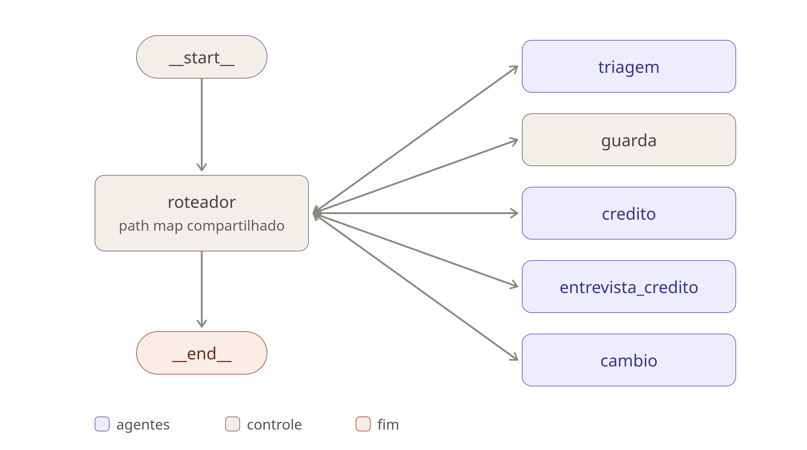

# Banco Ágil — Atendimento Bancário Multiagente

Sistema de atendimento conversacional construído com LangGraph, em que quatro
especializações internas se apresentam ao cliente como um único atendente.

---

# Visão Geral do Projeto

O Banco Ágil é um banco digital fictício. Este projeto implementa o atendimento virtual
dele: o cliente conversa em linguagem natural e resolve o que precisa sem saber que, por
trás, quatro agentes especializados dividem o trabalho.

O assistente autentica o cliente, consulta e processa pedidos de aumento de limite,
conduz uma entrevista de crédito que recalcula o score e responde sobre cotação de
moedas. Do ponto de vista de quem conversa, existe um atendente só: as transferências
entre especialidades acontecem sem anúncio, sem reapresentação e sem interromper a
resposta.

A regra que orienta o projeto inteiro é uma só:

> **O LLM conversa e interpreta. O Python decide.**

Cálculo de score, decisão de aprovar ou rejeitar um pedido, contagem de tentativas de
autenticação e escolha do próximo agente são funções Python determinísticas. Ao modelo
cabe extrair entidades da fala do cliente e verbalizar resultados. Toda a arquitetura
descrita abaixo existe para tornar essa separação estrutural, e não uma instrução de
prompt que o modelo pode ignorar.

---

# Arquitetura do Sistema



Cada mensagem do cliente é uma invocação do grafo. O bloco central do diagrama não é um
nó: representa o *path map* compartilhado pelas arestas condicionais, que todos os
agentes usam para decidir o próximo passo. A decisão é Python lendo o campo `agente_atual`
do estado — o modelo nunca escolhe um destino por texto livre.

As setas são de mão dupla de propósito. O roteamento despacha para um agente; ao terminar,
o agente devolve o controle às arestas, que avaliam de novo: se `agente_atual` continua o
mesmo, o turno acaba; se mudou, houve handoff e o próximo agente responde **na mesma
invocação**. O nó `guarda` aparece como controle porque não conversa com o cliente — ele
corrige o estado quando uma guarda de negócio recusa o destino pedido.

Os quatro agentes são intercambiáveis do ponto de vista do grafo, e é essa simetria que a
topologia mostra: qualquer um pode ser o primeiro, qualquer um pode transferir para outro,
e qualquer um pode encerrar o atendimento.

## Camadas

O sistema é dividido em camadas com dependência em sentido único:

```
ui → graph → agents → tools → services → repositories → CSV
```

Nenhuma camada importa de uma camada acima. `observability/` e `utils/` são transversais:
qualquer camada pode usá-las, e elas não dependem de ninguém.

### Repositories

Única camada do sistema que abre arquivo. Nenhuma outra chama `open` em CSV.

Toda escrita é atômica: os dados vão para um arquivo temporário no mesmo diretório do
destino e só então um `os.replace` troca o original, com todas as operações serializadas
por `filelock`. Uma falha no meio da gravação deixa a base intacta, e dois pedidos
simultâneos não sobrescrevem um ao outro.


### Services

Regras de negócio em Python puro. Esta camada não conhece LangChain, não sabe que existe
um LLM e é testável integralmente offline.

É onde vivem a fórmula de score, a decisão de aprovação de um pedido, a contagem de
tentativas de autenticação e a normalização das respostas da entrevista. A decisão de
aprovar um aumento, por exemplo, é literalmente uma comparação:

```python
maximo = limite_maximo_permitido(score, faixas)
aprovado = limite_solicitado <= maximo
```

### Tools

Adaptadores finos entre os agentes e os services. Uma tool valida a entrada, chama um
service e devolve um payload estruturado — sem regra de negócio e sem acesso a disco.

Suas docstrings são parte do prompt: descrevem, em português e de forma objetiva, quando
a ferramenta deve ser usada e o que ela retorna. É por elas que o modelo decide o que
chamar.

Duas invariantes valem para todas:

- **Nenhuma tool levanta exceção para o grafo.** Erro esperado — base ausente, API fora
  do ar, entrada inválida — vira um retorno `{"ok": false, "erro": ...}` com uma mensagem
  que o agente consegue verbalizar. O detalhe técnico fica no log.
- **O escopo de cada agente é o seu conjunto de ferramentas.** O mapa `TOOLS_POR_AGENTE`
  é a garantia: o agente de câmbio não consulta limite porque a ferramenta não existe no
  binding dele, não porque o prompt pede que ele não faça isso.

### Agentes

Quatro agentes, cada um com o seu domínio, suas ferramentas e o seu prompt versionado em
`src/banco_agil/prompts/`:

| Agente | Responsabilidade |
|---|---|
| **Triagem** | Autentica o cliente e encaminha para a especialidade certa |
| **Crédito** | Consulta o limite em vigor e processa pedidos de aumento |
| **Entrevista de Crédito** | Conduz as cinco perguntas e recalcula o score |
| **Câmbio** | Cotação de moedas e conversão de valores |

Cada agente recebe, a cada turno, um bloco de contexto montado em Python a partir do
estado: o limite atual formatado, a situação do último pedido, qual dos cinco campos da
entrevista falta perguntar. O modelo não deduz esses fatos — ele os lê prontos.

## Roteamento e handoff

O roteamento é determinístico. As arestas condicionais são funções Python que leem campos
do estado; o LLM nunca escolhe um destino por texto livre. Ele apenas chama uma *handoff
tool*, que escreve `agente_atual`, e a aresta faz o resto.

Duas decisões de projeto merecem destaque:

**O handoff não encerra o turno.** A tool de transferência encerra o subgrafo do agente de
origem sem devolver o controle ao LLM — assim ele não anuncia "vou te transferir" nem se
despede. A aresta do grafo pai lê `agente_atual` e o agente de destino responde na mesma
invocação. É isso que sustenta a ilusão de um atendente único.

**Existe um nó `guarda`.** As guardas de negócio ficam na aresta: nenhum agente além da
Triagem atua sem autenticação, e a entrevista tem teto de uma por sessão. Quando a aresta
recusa um destino, porém, não basta desviar — o campo `agente_atual` continuaria apontando
para o destino recusado, e o roteamento voltaria a recusá-lo a cada passo, em laço até
estourar o `recursion_limit`. O nó `guarda` corrige o estado antes de rotear.

## Fluxo de uma mensagem

Um cliente já autenticado escreve *"quero aumentar meu limite para 8000"*:

```
ui/session.py            invoke({"messages": [HumanMessage]}, thread_id)
  └─ rota_inicial        lê agente_atual do checkpoint → triagem
     └─ nó triagem       LLM chama transferir_para_credito
        └─ estado: agente_atual = CREDITO
     └─ rota_apos        agente_atual mudou → houve handoff → credito
        └─ nó credito    contexto injeta limite atual e último pedido
                         LLM chama solicitar_aumento_limite("8000")
           └─ tool        valida o valor → 8000.0
                          confere se o valor saiu da fala do cliente
                          └─ service processar_pedido_aumento
                             ├─ grava a solicitação como pendente     → CSV
                             ├─ avalia contra a faixa do score
                             └─ atualiza a linha para o desfecho      → CSV
           └─ LLM verbaliza o payload ao cliente
     └─ rota_apos        agente_atual continua CREDITO → fim do turno
  └─ resposta ao cliente
```

O modelo fez três coisas: transferiu, extraiu `"8000"` da frase e falou. Nada além disso.

## Manipulação dos dados

As bases são arquivos CSV em `data/`, com schemas normativos definidos pelo projeto:

| Arquivo | Acesso | Conteúdo |
|---|---|---|
| `clientes.csv` | leitura e escrita | CPF, nome, data de nascimento, limite atual e score |
| `score_limite.csv` | somente leitura | Faixas contíguas de score e o limite máximo de cada uma |
| `solicitacoes_aumento_limite.csv` | gerado em runtime | Histórico de pedidos com o desfecho de cada um |

`data/seed/` guarda a cópia pristina das duas primeiras bases e é versionada;
`data/clientes.csv` é mutável em runtime, porque a entrevista atualiza o score, e pode ser
restaurado a qualquer momento com `make reset-data`.

Um pedido de aumento é sempre **registrado antes de ser decidido**: a linha entra como
`pendente`, a avaliação acontece, e só então o status é atualizado para `aprovado` ou
`rejeitado`. Assim o pedido fica registrado mesmo que a avaliação falhe.

Nenhum dado de outros clientes entra no contexto do modelo: as consultas devolvem apenas
o registro do CPF autenticado, nunca a base inteira.

---

# Funcionalidades Implementadas

| Funcionalidade | Comportamento |
|---|---|
| **Autenticação** | CPF e data de nascimento conferidos contra a base, com limite de três tentativas por sessão e encerramento cordial na terceira falha. O contador vive no estado do grafo, não na contagem de mensagens |
| **Consulta de limite** | Limite em vigor, score atual e teto autorizado pela faixa do score |
| **Pedido de aumento** | Registra a solicitação, avalia contra a faixa e atualiza a linha com o desfecho. A aprovação registra a decisão do pedido e não altera o limite em vigor — o agente é explícito quanto a isso |
| **Entrevista de crédito** | Cinco perguntas em ordem fixa, sem pular nenhuma, com recálculo e persistência do novo score |
| **Nova tentativa pós-entrevista** | Se o valor rejeitado passa a caber no score novo, o mesmo valor é reoferecido ao cliente, uma única vez |
| **Câmbio** | Cotação USD-BRL em tempo real e conversão de valores. Se a fonte estiver indisponível, o agente informa com clareza em vez de estimar |
| **Encerramento** | Disponível a partir de qualquer agente, a pedido do cliente |
| **Conferência de valores** | Todo valor numérico registrado — limite pedido, renda, despesas, dependentes — precisa ter saído da fala do cliente |
| **Observabilidade** | Logs estruturados e traces no MLflow, com latência, tokens de entrada e saída, tool calls e erros por requisição |

---

# Desafios Enfrentados

Os problemas mais interessantes do projeto não foram de implementação, e sim de
comportamento do modelo. Em todos eles a solução seguiu o mesmo caminho: mover a garantia
do prompt para o Python.

### O modelo inventava valores que o cliente não disse

Um pedido de aumento de R$ 25.000 foi registrado para um cliente que havia dito apenas
"quero aumentar este limite" — o número saiu do meio do caminho entre o limite atual e o
teto da faixa, ambos citados pelo próprio sistema. Na entrevista, uma renda de R$ 8.000
foi gravada sem que a pergunta tivesse sido feita.

**Solução:** conferência de procedência. Antes de registrar qualquer valor, uma função
verifica se ele aparece no que o cliente efetivamente escreveu. A busca considera só as
mensagens do cliente — o que o sistema disse não conta como informação fornecida por ele.

### O modelo pulava perguntas da entrevista

Em vez de perguntar, o modelo preenchia os slots com valores plausíveis tirados do
histórico da conversa.

**Solução:** um middleware `after_model` marca no estado qual campo foi de fato perguntado
ao cliente, e a tool recusa registrar qualquer outro. Resposta com tool call não conta como
pergunta — só uma resposta em texto significa que o agente devolveu a palavra ao cliente.
O campo é consumido a cada registro, de modo que o próximo precisa ser perguntado de novo.


### O modelo barato emitia tool calls malformadas

O `gpt-oss` ocasionalmente vazava um token de controle do formato *harmony* dentro do nome
da ferramenta, e o provedor devolvia erro 400. O padrão era claro nos logs: as falhas se
concentravam em crédito e entrevista, e não apareciam em triagem nem em câmbio.

**Solução:** duas frentes. Um retry com predicado estreito, que reconhece a assinatura
específica desse defeito e não retenta requisições genuinamente malformadas; e a migração
de crédito e entrevista para um modelo mais robusto, mantendo o modelo barato onde ele
funcionava bem.

---

# Escolhas Técnicas e Justificativas

## Stack

| Ferramenta | Papel |
|---|---|
| **Python 3.11+** | Linguagem base |
| **LangGraph** | Orquestração do grafo e do estado |
| **LangChain** | Tools, mensagens e middlewares de agente |
| **Groq** (`langchain-groq`) | Provedor de LLM |
| **Streamlit** | Interface de teste |
| **Pydantic v2** + **pydantic-settings** | Modelos de domínio e configuração |
| **httpx** | Cliente HTTP da API de câmbio |
| **filelock** | Serialização do acesso aos CSVs |
| **MLflow** | Observabilidade e tracing |
| **pytest** + **ruff** | Testes e qualidade de código |
| **uv** | Gerenciamento de dependências |

## Por que LangGraph

Oferece o melhor controle sobre roteamento entre agentes e deixa o desenvolvedor enxergar
o comportamento do sistema de ponta a ponta. Mais importante para este projeto: as arestas
condicionais são funções Python comuns, o que permite que a decisão de roteamento seja
determinística e testável — nenhum framework precisa ser convencido a não deixar o modelo
escolher o próximo passo.

## Por que Groq

Acesso gratuito e de baixa latência a modelos capazes, com API compatível com o
ecossistema LangChain. A latência importa numa aplicação conversacional em que o cliente
está esperando na tela.

## Por que dois modelos

Modelo e temperatura são tratados como eixos independentes, combinados por perfil:

| Perfil | Agentes | Justificativa |
|---|---|---|
| Diálogo | Triagem, Câmbio | Conversa direta, tarefas simples: o modelo barato dá conta |
| Diálogo robusto | Crédito | Conversa, mas escreve estado permanente e lida com valores monetários |
| Extração | Entrevista | Modelo robusto a temperatura zero: a fala do cliente vira dado gravado, e criatividade aqui é defeito |

A separação nasceu de um problema observado, não de uma preferência: os erros se
concentravam em crédito e entrevista, justamente as tarefas mais complexas. Usar o modelo
robusto só onde ele é necessário mantém a taxa de erro baixa sem multiplicar o custo do
sistema inteiro.

## Por que a regra de negócio fica fora do LLM

Um modelo de linguagem é um bom intérprete de linguagem natural e um péssimo garantidor de
invariantes. Toda vez que uma regra existia apenas no prompt, ela acabou violada — e cada
uma das violações está documentada na seção de desafios. Quando a mesma regra virou função
Python, o problema parou de acontecer e ganhou um teste de regressão.

## Por que CSV com escrita atômica

O desafio define CSV como base de dados. A escolha de projeto foi tratá-lo com o mesmo
cuidado que se daria a um banco: escrita atômica e lock de arquivo. Um pedido de aumento
gravado pela metade seria pior que um pedido não gravado.

## Por que Streamlit

É interface de teste, não entregável de produto. A escolha privilegia o mínimo de código
de UI possível para poder conversar com o sistema — a lógica de atendimento não sabe que
o Streamlit existe, e trocá-lo por outra interface não tocaria nenhuma camada abaixo.

## Por que MLflow

Ferramenta já consolidada em Machine Learning tradicional, com suporte maduro a tracing de
aplicações de IA generativa. A integração é desenhada para nunca interferir no atendimento:
com o servidor desligado ou fora do ar, spans e tags viram operações vazias e o sistema
funciona normalmente, apenas sem traces.

---

# Tutorial de Execução e Testes

## Pré-requisitos

- Python 3.11, 3.12 ou 3.13
- [uv](https://docs.astral.sh/uv/) para gerenciar dependências
- Uma chave da [Groq](https://console.groq.com/keys) (gratuita)

## Instalação

```bash
git clone <url-do-repositorio>
cd agente_bancario_tech4humans
make install
```

## Configuração

```bash
cp .env.example .env
```

Abra o `.env` e preencha a única variável obrigatória:

```
GROQ_API_KEY=sua-chave-aqui
```

Todo o resto tem valor padrão em `src/banco_agil/config.py` e só precisa ser alterado para
mudar modelo, temperatura ou parâmetro de negócio. O `.env` não é versionado.

## Executando

```bash
make run
```

A aplicação sobe em `http://localhost:8501`. Se a chave estiver faltando, a própria tela
explica o que fazer, em vez de quebrar com um stack trace.

## Observabilidade (opcional)

Em outro terminal, antes de começar a conversa:

```bash
make mlflow
```

O painel fica em `http://localhost:5000`, no experimento `banco-agil`. Cada mensagem do
cliente vira um trace com latência, tokens de entrada e saída, tool calls e erros, e as
tags permitem filtrar por agente, por desfecho de pedido e por conversa.

A barra lateral da aplicação mostra se o tracing está gravando. Sem o servidor no ar o
sistema funciona igual, apenas sem traces — e se o MLflow subir no meio da conversa, a
aplicação se reconecta sozinha em até 30 segundos, sem precisar reiniciar.

## Dados para testar

As bases são fictícias. Estes são os clientes disponíveis:

| CPF | Nome | Nascimento | Limite | Score | Teto da faixa |
|---|---|---|---|---|---|
| `52998224725` | Helena Ribeiro Antunes | 12/03/1985 | R$ 5.000 | 730 | R$ 15.000 |
| `11144477735` | Marcos Vinicius Prado | 30/07/1992 | R$ 2.000 | 320 | R$ 3.000 |
| `39053344705` | Beatriz Camargo Lopes | 04/11/1990 | R$ 2.500 | 470 | R$ 3.000 |
| `12894601590` | Otávio Nunes Bittencourt | 22/01/1978 | R$ 20.000 | 910 | R$ 30.000 |
| `21987894006` | Larissa Fontes Machado | 09/05/1996 | R$ 4.000 | 500 | R$ 8.000 |
| `30841145792` | Rogério Duarte Salles | 17/09/1969 | R$ 800 | 299 | R$ 1.000 |
| `45130988302` | Tiago Meireles Cardoso | 01/12/2000 | R$ 0 | 0 | R$ 1.000 |
| `58327160435` | Cecília Andrade Peixoto | 25/04/1974 | R$ 28.000 | 1000 | R$ 30.000 |
| `67204918304` | Fernanda Quintela Rosa | 14/08/1988 | R$ 6.000 | 650 | R$ 8.000 |
| `74516829002` | André Sampaio Vasconcelos | 12/03/1985 | R$ 5.000 | 540 | R$ 8.000 |

O CPF pode ser digitado com ou sem pontuação, e a data em `DD/MM/AAAA` ou `AAAA-MM-DD`.
As faixas de score ficam em `data/score_limite.csv`.

> Os CPFs são válidos no dígito verificador e foram gerados para teste. Não pertencem a
> ninguém.

## Roteiros de teste

### 1. Aumento aprovado direto

Autentique-se como **Helena** (`52998224725`, `12/03/1985`) e peça R$ 10.000. O score 730
dá um teto de R$ 15.000, então o pedido é aprovado.

Repare na formulação da resposta: o agente diz que a solicitação foi aprovada e que o novo
limite será aplicado em breve — nunca que ele já está valendo. A aprovação registra a
decisão do pedido e não altera o limite em vigor.

### 2. Ciclo completo: rejeição → entrevista → aprovação

É o roteiro que exercita o sistema inteiro. Autentique-se como **Beatriz**
(`39053344705`, `04/11/1990`):

1. Peça **R$ 8.000**. O score 470 dá um teto de R$ 3.000, e o pedido é **rejeitado**.
2. Aceite a entrevista quando ela for oferecida.
3. Responda: renda `8000`, despesas `2000`, vínculo `formal`, `0` dependentes, sem dívidas.
4. O score é recalculado para **620** e gravado em `data/clientes.csv`.
5. O agente reoferece os mesmos R$ 8.000, que agora cabem no teto de R$ 8.000 da nova
   faixa, e o pedido é **aprovado**.

Ao final, confira `data/solicitacoes_aumento_limite.csv`: duas linhas para o mesmo CPF,
uma `rejeitado` e uma `aprovado`.

### 3. Limite de tentativas de autenticação

Informe um CPF ou uma data que não existam, três vezes seguidas. Na terceira falha o
atendimento é encerrado com cordialidade.

Vale testar também o CPF da Helena com a data de nascimento do Otávio: os dois dados
precisam bater juntos.

### 4. Câmbio

Pergunte "quanto está o dólar hoje?" e em seguida "converta 250 dólares". A cotação vem da
AwesomeAPI em tempo real. Se a API estiver indisponível, o agente informa com clareza —
não estima nem inventa valor.

### 5. Escopo garantido por ferramenta

Dentro do atendimento de câmbio, pergunte qual é o seu limite. O agente não tem a
ferramenta de consulta de limite no binding dele: em vez de responder errado, transfere o
atendimento. A restrição é estrutural, não uma instrução de prompt.

### 6. Recusa a inventar valores

Autentique-se e diga apenas "quero aumentar meu limite", sem citar nenhum valor. O agente
pergunta quanto você quer em vez de escolher um número.

O mesmo vale na entrevista: responda "não lembro" quando ele perguntar a renda, e veja a
pergunta ser repetida em vez de um valor plausível ser gravado.

## Testes automatizados

```bash
make test
```

São 446 testes, todos offline — nenhuma chamada de LLM ou de rede:

- **`tests/unit/`** cobre `services/`, `repositories/`, `utils/` e a montagem dos agentes.
  É onde ficam os testes de fronteira da fórmula de score, da escrita atômica em CSV e das
  conferências de procedência de valor.
- **`tests/integration/`** exercita o grafo compilado com um modelo falso roteirizado,
  validando roteamento, guarda de autenticação, contagem de tentativas e o ciclo
  crédito ⇄ entrevista.

Para rodar um recorte:

```bash
uv run pytest tests/unit/test_services_score.py -v   # um arquivo
uv run pytest -m integration                          # só os testes de integração
```

## Qualidade de código

```bash
make lint     # ruff check + ruff format --check
make format   # aplica a formatação
```

## Utilitários

```bash
make reset-data   # restaura as bases a partir de data/seed/ e apaga as solicitações
make grafo        # redesenha docs/grafo.png a partir do grafo compilado
```

O `make reset-data` é útil depois de rodar os roteiros acima: a entrevista altera o score
em `data/clientes.csv`, e o comando devolve a base ao estado original.

O `make grafo` gera `docs/grafo.png` exportando o desenho diretamente do grafo compilado.
É a forma de conferir que a topologia mostrada no início deste documento corresponde ao
que está de fato construído em `graph.py`.
